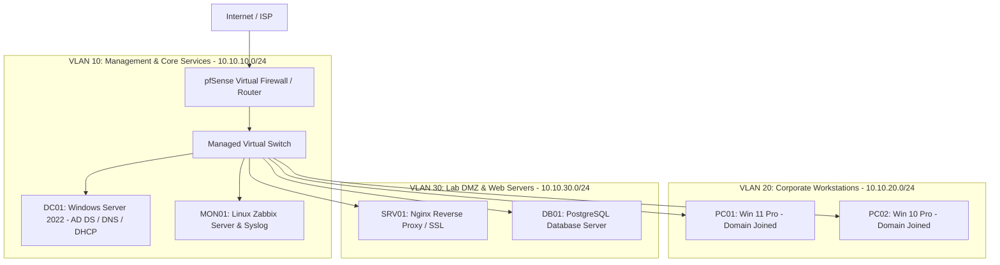

# Muhammad Rizky | IT Operations & Systems Support Runbook

Dokumentasi teknis, prosedur standar operasional (SOP), investigasi akar masalah insiden (Root Cause Analysis / ITIL Postmortems), dan arsitektur homelab untuk peran **IT Support Specialist**, **L2 Systems Support**, dan **Junior Systems Administrator**.

---

## Ringkasan Profil Teknis

Praktisi Sistem Informasi (S1 Sistem Informasi - UNISNU Jepara) dengan keahlian operasional infrastruktur IT, manajemen direktori (Active Directory / Entra ID), administrasi jaringan (VLAN / Firewall), database troubleshooting (SQL), dan otomasi administrasi sistem (PowerShell / Bash).

| Domain | Teknologi Utama |
|---|---|
| **Sistem Operasi & Server** | Windows Server 2019/2022, Windows 10/11 Pro, Ubuntu Server, Debian |
| **Direktori & Identitas** | Active Directory Domain Services (AD DS), Azure AD / Entra ID, Group Policy (GPO), DNS/DHCP |
| **Jaringan & Keamanan** | pfSense/OPNsense, Cisco Switch (VLAN 802.1Q), OpenVPN/WireGuard, Wireshark, UFW, Iptables |
| **Virtualisasi & Cloud** | Proxmox VE, Hyper-V, AWS (EC2, S3, VPC, IAM), Docker |
| **Database & Kueri** | SQL (PostgreSQL, MySQL, SQL Server) — analisa data korup & error log |
| **Bahasa Skrip** | PowerShell 7, Bash Shell, Python |
| **ITSM & Monitoring** | Standar ITIL v4 (Incident, Problem, Change), Zabbix, Windows Event Viewer |

---

## Topologi Homelab & Lingkungan Uji Coba

Seluruh studi kasus, pengujian insiden, dan skrip pada repositori ini diuji pada lingkungan virtualisasi terisolasi:

---

## Struktur Dokumentasi

1. **[Kredensial & Sertifikasi](certifications.md)**  
   Verifikasi sertifikasi resmi (Dicoding, AWS Cloud, SQL, Data Science) yang dipetakan langsung ke fungsi dukungan teknis.
2. **[Studi Kasus Insiden (ITIL)](incidents/INC-202609-kerberos-auth-skew.md)**  
   Laporan post-mortem investigasi kegagalan sistem nyata: diagnosa CLI, analisis 5-Whys, mitigasi, dan tindakan pencegahan.
3. **[SOP Operasional](sops/active-directory/user-onboarding.md)**  
   Panduan teknis langkah-demi-langkah onboarding Active Directory dan pemeliharaan server Linux.
4. **[Arsitektur Jaringan](networking/vlan-segmentation-matrix.md)**  
   Dokumentasi matriks segmentasi VLAN, alokasi subnet, dan konfigurasi firewall edge.
5. **[Otomasi & Skrip](scripts/powershell/audit-stale-ad-accounts.md)**  
   Skrip PowerShell dan Bash siap pakai untuk audit sistem berkala dan self-healing service.
