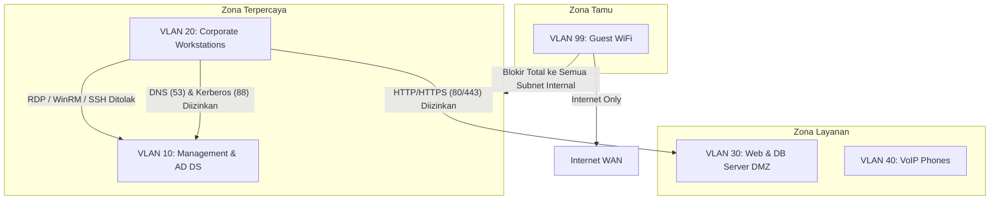

# Matriks Segmentasi Jaringan & Alokasi VLAN

Dokumentasi rancangan arsitektur jaringan lokal kantor, pemisahan segmen VLAN (802.1Q), alokasi subnet IPv4, dan alokasi DHCP.

---

## 1. Tabel Alokasi VLAN & Subnet

| VLAN ID | Nama Segmen | Subnet IP | Gateway | Rentang DHCP Pool | Tujuan & Tingkat Kepercayaan |
|---|---|---|---|---|---|
| **VLAN 10** | `MGMT-CORE` | `10.10.10.0/24` | `10.10.10.1` | Statik Only | Server fisik, Domain Controller, Switch, PDU. *Tingkat kepercayaan: Tertinggi.* |
| **VLAN 20** | `CORP-USERS` | `10.10.20.0/24` | `10.10.20.1` | `.100` s/d `.250` | Laptop & PC karyawan domain-joined. *Tingkat kepercayaan: Menengah.* |
| **VLAN 30** | `SRV-DMZ` | `10.10.30.0/24` | `10.10.30.1` | Statik Only | Nginx proxy, web portal internal, database server. *Tingkat kepercayaan: Terisolasi.* |
| **VLAN 40** | `VOIP-COMM` | `10.10.40.0/24` | `10.10.40.1` | `.50` s/d `.200` | IP Phone SIP, video conference room hardware. Prioritas QoS DSCP 46 (EF). |
| **VLAN 99** | `GUEST-WIFI` | `192.168.99.0/24`| `192.168.99.1` | `.10` s/d `.240` | Perangkat tamu, smartphone pribadi (BYOD). Hanya internet keluar. |

---

## 2. Diagram Alur Isolasi Antar-VLAN



---

## 3. Konfigurasi Trunk Port pada Switch (Cisco IOS)

Contoh konfigurasi uplink port switch yang terhubung ke router/firewall gateway:

```text
interface GigabitEthernet0/1
 description UPLINK-TO-PFSENSE-GATEWAY
 switchport mode trunk
 switchport trunk native vlan 1
 switchport trunk allowed vlan 10,20,30,40,99
 spanning-tree portfast trunk
!
interface Range GigabitEthernet0/2 - 24
 description USER-ACCESS-PORTS
 switchport mode access
 switchport access vlan 20
 spanning-tree bpduguard enable
 spanning-tree portfast
```

---

## 4. Keamanan Port (Port Security)
Pada VLAN 20 (Corporate Users), fitur Port Security diaktifkan untuk mencegah penambahan switch mini ilegal di meja kerja:
```text
switchport port-security
switchport port-security maximum 2
switchport port-security violation restrict
switchport port-security mac-address sticky
```
